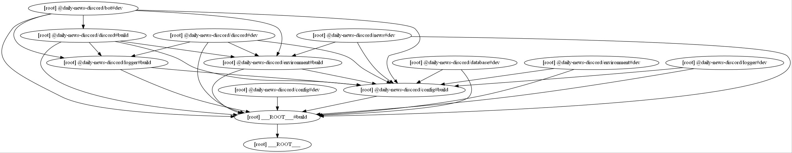
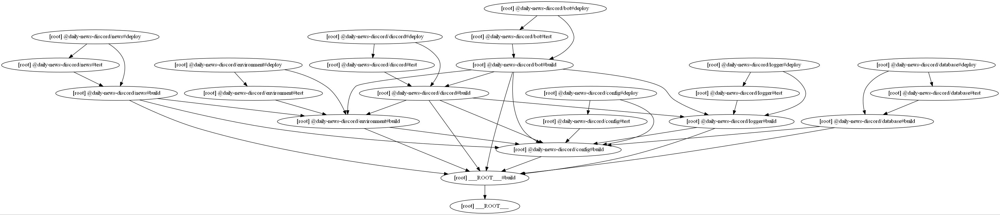

# Daily News Discord

Simple news bot created with discord.js

## Prerequisites
- node
- pnpm


## Installation
Clone the repository and install the dependencies with the following command:
```bash
git clone https://github.com/SushiWaUmai/daily-news-discord.git
cd daily-news-discord
pnpm install
```

Start developing
```bash
pnpm run dev
```

## Build Pipeline
### Development


### Deployment
