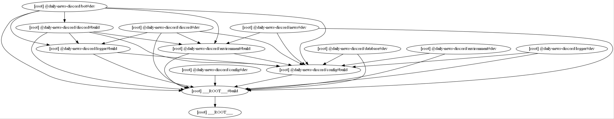
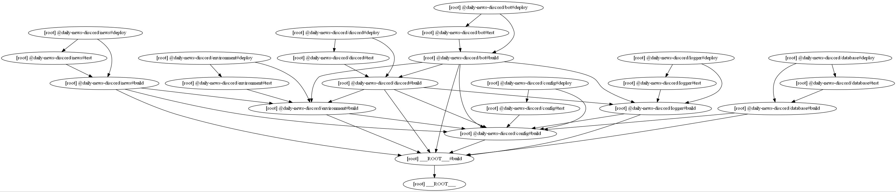

# Daily News Discord

Simple news bot created with discord.js

## How to setup

Add the bot using [this link](https://discord.com/api/oauth2/authorize?client_id=947850099864768523&permissions=8&scope=bot%20applications.commands).

In the discord server, type `news help` to see the list of commands.

## Commands

#### `news help`

See the list of commands.

#### `news cat`

See the list of available categories.

#### `news sub`

Subscribe a category to this channel.

#### `news unsub`

Unsubscribe a category to this channel.

#### `news list`

Prints all categories subscribed to this channel.

## Development
### Prerequisites

- docker and docker-compose

### Installation

Clone the repository and install the dependencies with the following command:

```bash
git clone https://github.com/SushiWaUmai/daily-news-discord.git
cd daily-news-discord
pnpm install
```

Start developing

```bash
pnpm run dev
```

### Build Pipeline

#### Development



#### Deployment



## License
[MIT License](LICENSE)